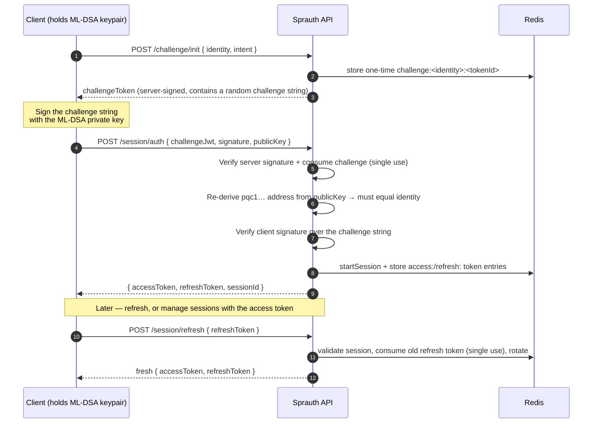

# Sprauth

**Passwordless, post-quantum authentication as a service.**

Sprauth is a self-hostable authentication API that replaces passwords (and classical
signatures) with **post-quantum cryptography**. Instead of a shared secret, every client
holds an [ML-DSA-65](https://csrc.nist.gov/pubs/fips/204/final) (Dilithium) keypair and
proves ownership of it through a challenge–response handshake. The server issues short-lived,
server-signed session tokens and tracks their liveness in Redis, so tokens can be expired
_and_ revoked on demand.

No passwords to leak. No classical signatures to break on a quantum computer. Just a keypair
and a signature.

---

## Table of contents

- [Why Sprauth](#why-sprauth)
- [How it works](#how-it-works)
- [Quick start](#quick-start)
- [Configuration](#configuration)
- [API reference](#api-reference)
- [Identity & token model](#identity--token-model)
- [Client integration](#client-integration)
- [Tooling & scripts](#tooling--scripts)
- [Development](#development)
- [Project structure](#project-structure)
- [Security notes](#security-notes)
- [License](#license)

---

## Why Sprauth

| | |
|---|---|
| 🔐 **Post-quantum** | Authentication is built on ML-DSA-65, a NIST-standardized lattice signature scheme that resists both classical and quantum attacks. |
| 🚫 **Passwordless** | A client's identity _is_ its public key. There is no password database to breach, phish, or reset. |
| 🎟️ **Revocable sessions** | Access and refresh tokens are backed by Redis entries — they expire on a TTL and are killed instantly when a session ends. |
| 📦 **Containerized** | Multi-stage Docker build ships only compiled JS + production deps. Point it at a Redis instance and go. |
| 🧩 **Simple surface** | A handful of REST endpoints, a custom JWT-like token, and a Postman collection covering every route. |

---

## How it works

A client's **identity** is an address derived from its public key:

```
identity = "pqc1" + hex( sha256(publicKey) )[-20 bytes]
```

Authentication is a **challenge–response** flow. The server never sees the private key; it only
verifies signatures.



Because the address is a hash of the public key, only the holder of the matching private key
can produce a signature that both verifies _and_ derives back to the claimed identity.

---

## Quick start

Sprauth needs a **Redis** instance for challenge/session/token storage, and a **server keypair**
(`SPRAUTH_MLDSA_PRIVATE_KEY`). The fastest way to run everything is Docker Compose.

### 1. Generate a server keypair

```bash
npx tsx scripts/keygen.tsx
```

This prints a private key, public key, and address. Copy the private key value — you'll feed it
to the server as `SPRAUTH_MLDSA_PRIVATE_KEY` (the script labels it `MLDSA_PRIVATE_KEY`).

### 2. Run with Docker Compose

Sprauth doesn't ship a `docker-compose.yml`, but this is all you need:

```yaml
# docker-compose.yml
services:
  redis:
    image: redis:7-alpine
    restart: unless-stopped

  sprauth:
    build: .
    ports:
      - "3000:3000"
    environment:
      SPRAUTH_MLDSA_PRIVATE_KEY: "<paste the base64 private key from step 1>"
      SPRAUTH_REDIS_URL: "redis://redis:6379"
    depends_on:
      - redis
    restart: unless-stopped
```

```bash
docker compose up --build
# API is now live on http://localhost:3000
```

### 3. Try the full login flow

With the server running, drive a complete `init → sign → auth` handshake with a throwaway client:

```bash
SPRAUTH_BASE_URL=http://localhost:3000 npx tsx scripts/demo_login.tsx
```

You'll see the client identity, the challenge, and the returned `accessToken` / `refreshToken` /
`sessionId`.

### Docker without Compose

```bash
docker build -t sprauth-api .
docker run -p 3000:3000 \
  -e SPRAUTH_MLDSA_PRIVATE_KEY="<base64 private key>" \
  -e SPRAUTH_REDIS_URL="redis://host.docker.internal:6379" \
  sprauth-api
```

> The Docker image contains **only the API** — you must provide a reachable Redis instance via
> `SPRAUTH_REDIS_URL`.

---

## Configuration

All configuration is via environment variables.

| Variable | Required | Default | Description |
|---|:---:|---|---|
| `SPRAUTH_MLDSA_PRIVATE_KEY` | ✅ | — | Base64-encoded ML-DSA-65 secret key for the server. The process **throws on startup** if unset. Generate with `scripts/keygen.tsx`. |
| `SPRAUTH_REDIS_URL` | | `redis://localhost:6379` | Redis connection string. |
| `SPRAUTH_CHALLENGE_TTL` | | `600` (10 min) | Challenge lifetime, in seconds. |
| `SPRAUTH_SESSION_TTL` | | `2592000` (30 days) | Session lifetime, in seconds. Renewed on each successful refresh. |
| `SPRAUTH_ACCESS_TOKEN_TTL` | | `3600` (1 hour) | Access-token lifetime, in seconds. |
| `SPRAUTH_REFRESH_TOKEN_TTL` | | `604800` (1 week) | Refresh-token lifetime, in seconds. |
| `PORT` | | `3000` | HTTP port. |

---

## API reference

Base URL: `http://<host>:<port>`. All request/response bodies are JSON.

### Public key

| Method | Path | Auth | Description |
|---|---|---|---|
| `GET` | `/sec/key/public` | none | Returns the server's ML-DSA-65 public key (base64) for verifying server-issued tokens. |

### Challenge

| Method | Path | Auth | Body | Description |
|---|---|---|---|---|
| `POST` | `/challenge/init` | none | `{ identity, intent, customClaims? }` | Issues a server-signed, single-use challenge token for `identity`. `customClaims` (optional object) is embedded in the token but can't override reserved claims. |
| `POST` | `/challenge/valid` | none | `{ identity, tokenId, consume? }` | Checks whether a challenge is still pending. `consume: true` atomically removes it; otherwise it's a non-destructive poll. |

### Session

| Method | Path | Auth | Body / Query | Description |
|---|---|---|---|---|
| `POST` | `/session/auth` | none | `{ challengeJwt, signature, publicKey }` | Completes the handshake. Verifies the challenge + client signature, then mints `accessToken`, `refreshToken`, and opens a session. |
| `POST` | `/session/refresh` | refresh token | `{ refreshToken }` | Validates and **single-use consumes** the refresh token, then mints (rotates) a fresh token pair for the same session. |
| `GET` | `/session/` | none ⚠️ | `?identity=` | Lists a user's active session IDs. |
| `GET` | `/session/valid` | none ⚠️ | `?identity=&sessionId=&renewTtl=` | Reports whether a session is live; optionally renews its TTL. |
| `POST` | `/session/end` | **access token** | `{ sessionId }` | Ends a single session. Identity is taken from the token, so a caller can only end **their own** sessions. |
| `POST` | `/session/revoke` | **access token** | `{ except? }` | Ends all of the caller's sessions except those in `except`. |

Access-token-protected routes expect an `Authorization: Bearer <accessToken>` header.

### Admin

| Method | Path | Auth | Query | Description |
|---|---|---|---|---|
| `GET` | `/admin/challenges/count` | none ⚠️ | `?identity=` | Outstanding challenges for an identity. |
| `GET` | `/admin/challenges/count/all` | none ⚠️ | — | Outstanding challenges, system-wide. |
| `GET` | `/admin/sessions/count` | none ⚠️ | `?identity=` | Active sessions for an identity. |
| `GET` | `/admin/sessions/count/all` | none ⚠️ | — | Active sessions, system-wide. |

> ⚠️ Routes marked **none ⚠️** are currently **unauthenticated** — see [Security notes](#security-notes).

A [Postman collection](postman/) (`postman/sprauth.postman_collection.json` +
`postman/sprauth.local.postman_environment.json`) covers every route.

---

## Identity & token model

### Identity

```
identity = "pqc1" + hex( sha256(publicKey)[-20:] )
```

ML-DSA-65 public keys are exactly **1952 bytes**. Addresses aren't secret — they're derived
from the public key — so possession of an address grants nothing without the private key.

### Tokens

Sprauth tokens are a **custom JWT-like structure** (they are _not_ interoperable with standard
JWT — the algorithm space differs):

```
base64url(header) . base64url(payload) . base64url(signature)
```

- **Header:** fixed `{ "alg": "ML-DSA-65", "typ": "JWT" }`.
- **Signature:** ML-DSA-65 over `header.payload`, using the **server's** key. Verify it with the
  public key from `GET /sec/key/public`.
- Challenge, access, and refresh tokens are all self-issued by the server. The _client's_
  signature (in `/session/auth`) is a separate thing — it signs the raw challenge string with the
  client's key.

Payloads carry an `iat` but **no `exp`** — liveness is entirely **Redis-backed**. Each token type
has a backing entry that must exist for the token to be accepted; its TTL bounds the token's life,
and deleting it revokes the token instantly.

| Token | Redis key | TTL | Use | Revoked on session end |
|---|---|---|:---:|:---:|
| Challenge | `challenge:<identity>:<tokenId>` | `SPRAUTH_CHALLENGE_TTL` | single-use | — |
| Access | `access:<identity>:<sessionId>:<id>` | `SPRAUTH_ACCESS_TOKEN_TTL` | multi-use | ✅ |
| Refresh | `refresh:<identity>:<sessionId>:<id>` | `SPRAUTH_REFRESH_TOKEN_TTL` | single-use (rotated) | ✅ |

Refresh tokens are **rotated**: each successful `/session/refresh` consumes the presented token
and issues a new pair, so a replayed refresh token is rejected.

---

## Client integration

A client library needs to do three things: hold an ML-DSA-65 keypair, derive its address, and sign
challenge strings. Here's the full flow (see [`scripts/demo_login.tsx`](scripts/demo_login.tsx)
for a runnable version):

```ts
import { ml_dsa65 } from '@noble/post-quantum/ml-dsa.js';
import { createHash } from 'node:crypto';

const baseUrl = 'http://localhost:3000';

// 1. Client keypair + identity
const { secretKey, publicKey } = ml_dsa65.keygen();
const publicKeyBase64 = Buffer.from(publicKey).toString('base64');
const identity = `pqc1${createHash('sha256').update(publicKey).digest().subarray(-20).toString('hex')}`;

// 2. Request a challenge
const init = await fetch(`${baseUrl}/challenge/init`, {
  method: 'POST',
  headers: { 'Content-Type': 'application/json' },
  body: JSON.stringify({ identity, intent: 'login', customClaims: {} }),
});
const { challengeToken } = await init.json();

// 3. Sign the challenge string embedded in the token
const challenge = JSON.parse(
  Buffer.from(challengeToken.split('.')[1], 'base64url').toString('utf8'),
).challenge;
const signature = Buffer.from(
  ml_dsa65.sign(new TextEncoder().encode(challenge), secretKey),
).toString('base64');

// 4. Authenticate → receive tokens
const auth = await fetch(`${baseUrl}/session/auth`, {
  method: 'POST',
  headers: { 'Content-Type': 'application/json' },
  body: JSON.stringify({ challengeJwt: challengeToken, signature, publicKey: publicKeyBase64 }),
});
const { accessToken, refreshToken, sessionId } = await auth.json();

// 5. Use the access token for protected calls
await fetch(`${baseUrl}/session/revoke`, {
  method: 'POST',
  headers: { 'Content-Type': 'application/json', Authorization: `Bearer ${accessToken}` },
  body: JSON.stringify({ except: [sessionId] }), // "log out everywhere else"
});
```

---

## Tooling & scripts

| Command | Description |
|---|---|
| `npx tsx scripts/keygen.tsx` | Generate a fresh ML-DSA-65 keypair (private key, public key, address). |
| `npx tsx scripts/derive_pubk.tsx` | Derive the public key + address from `SPRAUTH_MLDSA_PRIVATE_KEY`. |
| `SPRAUTH_BASE_URL=… npx tsx scripts/demo_login.tsx [intent]` | Run a full `init → sign → auth` flow against a running server and print the resulting tokens (plus values to replay in Postman). |

---

## Development

Requires **Node.js 20+**. This is an ESM package (`"type": "module"`) with `NodeNext` resolution —
relative imports use `.js` extensions even in `.ts` source.

```bash
npm install

# Run the API with auto-reload (tsx + nodemon)
export SPRAUTH_MLDSA_PRIVATE_KEY="<base64 private key>"   # from scripts/keygen.tsx
npm run dev

# Type-check and compile to dist/
npm run build

# Run the compiled server
npm start
```

You'll also need Redis running locally (`redis://localhost:6379` by default).

### Tests

Tests use [Vitest](https://vitest.dev/). A fresh server keypair is auto-generated in
`src/tests/setup.ts`, so no key is needed for the suite. The end-to-end tests exercise the real
routes against Redis via Supertest.

```bash
npm test              # watch mode
npm run test:e2e      # run the e2e suite once
npm run test:coverage # coverage report
```

---

## Project structure

```
src/
├─ app.ts               # Express app + route mounting
├─ routes/              # HTTP verb/path wiring
├─ controllers/         # Request parsing, validation, response shaping
├─ middleware/          # requireAccessToken (Bearer access-token guard)
├─ services/
│  ├─ sec.service.ts    # ML-DSA crypto: sign, verify, address derivation
│  ├─ auth.service.ts   # Challenge/token generation
│  └─ redis.service.ts  # Challenge, session, access & refresh storage
└─ tests/               # Vitest setup + e2e suites
scripts/                # keygen, derive_pubk, demo_login
postman/                # Postman collection + local environment
```

The app is layered: **routes → controllers → services**. Crypto and Redis live entirely in the
service layer.

---

## Security notes

- **`/session/end` and `/session/revoke` require an access token** and derive the caller identity
  from it — you can only manage your own sessions.
- **`/session/` (list), `/session/valid`, and all `/admin/*` routes are currently unauthenticated.**
  Because `pqc1…` addresses aren't secret, anyone who knows an address can currently list or count
  that identity's sessions. Gate these behind access-token verification before relying on them in a
  hostile environment.
- **Keep `SPRAUTH_MLDSA_PRIVATE_KEY` secret.** It signs every server-issued token; anyone with it
  can mint valid access/refresh tokens. Inject it via secrets management, never bake it into an image.
- There is **no centralized error-handling middleware** — unhandled errors fall through to Express's
  default handler.

---

## License

MIT © Tzvetomir Tzvetkov (see the `license` field in [`package.json`](package.json)).
